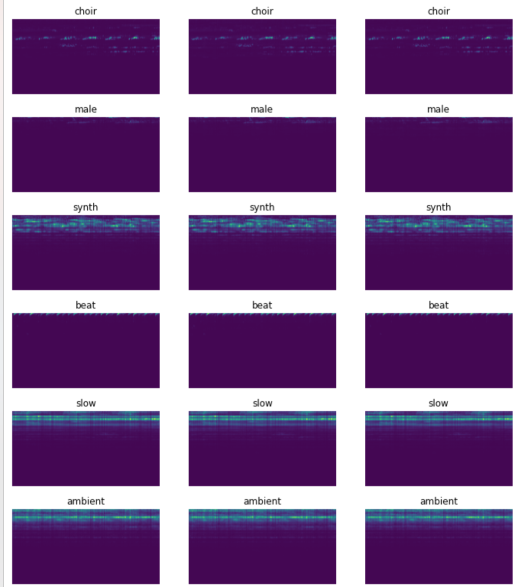

# Musicnn Conditional VAE

Sound generation using VAE, conditioned on [musicnn](https://github.com/jordipons/musicnn) tags.

You can download a tiny model [here](https://drive.google.com/file/d/1S3gVB1bJD96FDe7ROC95odTwVVtwzsc6/view?usp=sharing).

Some sample melspecs + extracted tags are in the `data` directory, to play with the `Generate` notebook without training again.

! A coolest CNN version coming soon (I hope) !

If you find some inconsistencies or errors, feel free to reach out and ask for a pull request, [I am human after all](https://www.youtube.com/watch?v=PXYeARRyDWk) :)

🎧 If you use it for your musical projects, send some links over, I am always listening to new music!

### Usage
 1. Dataset: generate your own dataset.
 2. Train: train the model, playground for generation, latent space visualization.
 3. Generate: playground for generation + an attempt of style transfer to condition the generation having one tag to match another one.

### Credits
* Took a lot of inspiration from [https://github.com/s-omranpour/X-VAE-keras](https://github.com/s-omranpour/X-VAE-keras) for the network architecture.

